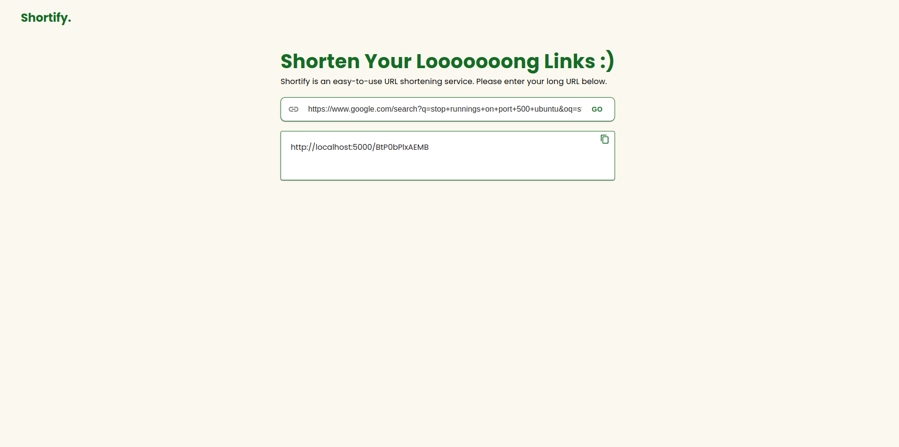

# LinkShortnerApp

LinkShortnerApp is a URL shortening service that allows users to shorten long URLs into more manageable links. This application provides a user-friendly interface for managing shortened links and integrates a robust backend for handling URL shortening and redirection.

## Technology Stack

- **Frontend:**
  - **React:** JavaScript library for building user interfaces.
  - **Material-UI (MUI):** React components for faster and easier web development.

- **Backend:**
  - **Express.js:** Web application framework for Node.js.
  - **MongoDB:** NoSQL database for storing URL data.
